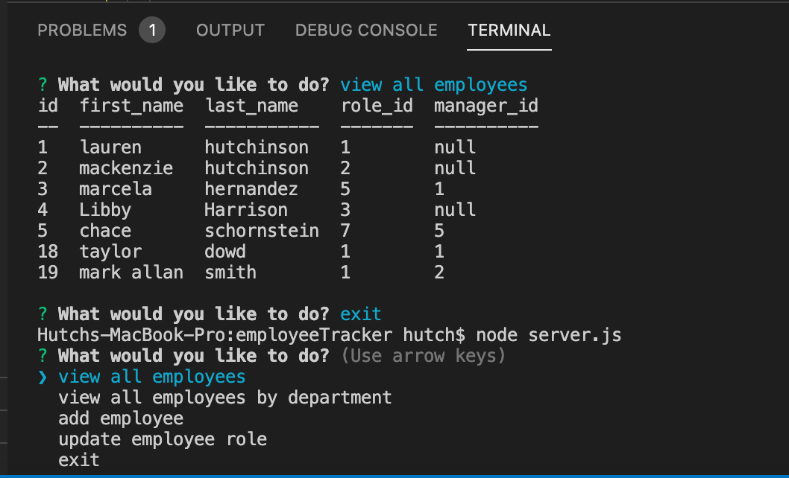
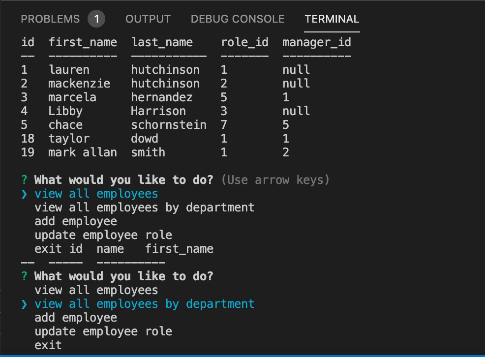
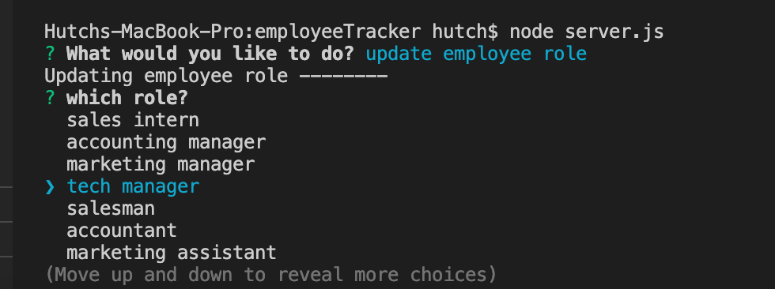

<h1>Employee Tracker</h1>

<h2>Project Details</h2>

This full stack web application allows the user/business owner to view employees, view the employees by their role, add new employees to the mySQL database, and update the roles desired. The nodeJS command-line takes in the user information to allow them to interact with backend database, so that the business owner can organize their business.

To start the server, simply open the terminal and run: "nodemon server.js" if you have nodemon installed. Otherwise, use "node server.js"

<h2>Images</h2>

<h2>Questions</h2>

Github username: lhutchinson22

For a look at my repositories click this link: https://github.com/lhutchinson22

You can reach me at my email address: lbhutchinson022@gmail.com, if you have any questions at all!

